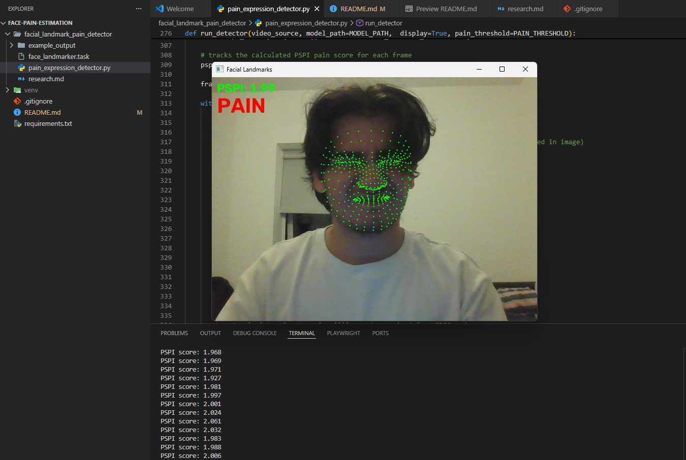
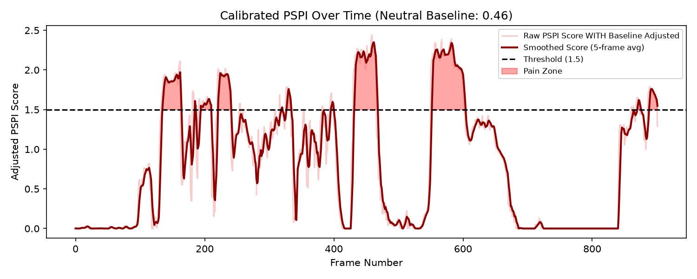
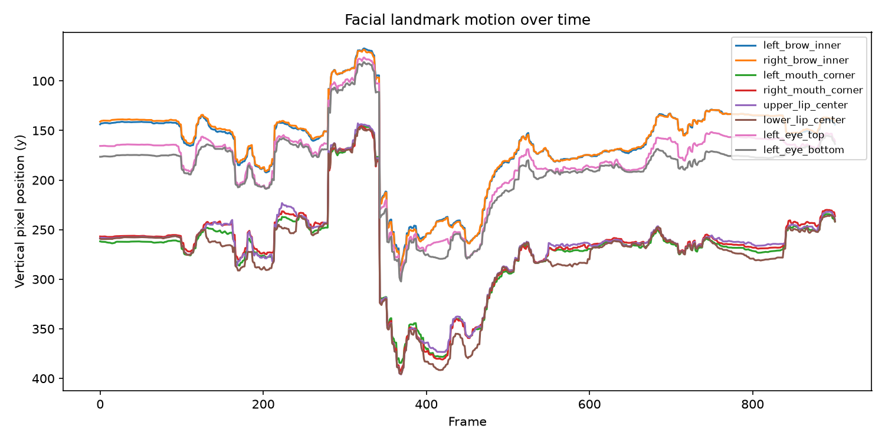
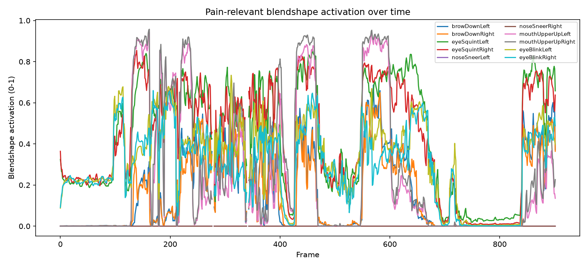

# Facial Pain Expression Detector (Face the Pain)

A small proof-of-concept / demo that estimates a heuristic "pain score" from a face, live from a webcam or from a video file, using MediaPipe's face landmark and blendshape detection.

## Example Output





## What it does

The `landmark_motion.py` script tracks a face frame-by-frame and computes a proxy* of the **PSPI (Prkachin & Solomon Pain Intensity)** score which is the formula/metric used to classify four levels of pain intensity (none, trace, weak, and strong).


```
PSPI = AU4 + max(AU6, AU7) + max(AU9, AU10) + AU43
```

| Term | Meaning |
|---|---|
| AU4 | Brow lowerer |
| AU6 / AU7 | Cheek raiser / lid tightener |
| AU9 / AU10 | Nose wrinkler / upper lip raiser |
| AU43 | Eye closure |

> [PSPI Source](https://pmc.ncbi.nlm.nih.gov/articles/PMC7385931/)

*Real Action Units (AUs) need a dedicated AU-detection model (e.g. py-feat or OpenFace). This is a simpler version that uses
**MediaPipe blendshapes** (expression coefficients like `browDownLeft`, `eyeSquintLeft`, `noseSneerLeft`) as a proxy for each AU.
This means the result is not really a validated measurement therefore may not be incredibly accurate.

When the PSPI score crosses a threshold, the word **PAIN** is displayed on the video in real time. The script also records the data for each frame of the session in dictionaries. These are then used to produce 4 plots once the session ends.

## Why did I create this?

I put myself through the pain (not really, there's a ton of good tutorials) of building this project in order to get some hands-on experience with the fundementals of sequence-level pain estimation from face videos. I learned about:
- Facial landmark extractions,
- Action Units
- PSPI
- And a lot more...

It's intentionally simple and doesn't use a trained model to estimate pain. However I do plan on building on this project and trying out more complex implementations. Namely, I want to get my hands on `py-feat` and `OpenFace`.


## Set-up

```bash
python3 -m venv venv
source venv\Scripts\activate         

pip install -r requirements.txt
```

## Usage

**Webcam, live:**
```bash
python pain_expression_detector.py --webcam
```

**A video file:**
```bash
python pain_expression_detector.py --video path/to/clip.mp4
```

**Options:**

| Flag | Description | Default |
|---|---|---|
| `--webcam` | Use the live webcam | - |
| `--video PATH` | Use a video file instead of webcam | - |
| `--model PATH` | Path to the `.task` model file | `face_landmarker.task` |
| `--pain-threshold FLOAT` | PSPI score above which "PAIN" is shown | `PAIN_THRESHOLD` |
| `--no-display` | Skip the live OpenCV window (for headless/batch processing) | off |

Press `q` to end a live session.

### Tuning the threshold

The default threshold of `1.5` is just a guess that worked for me, not a calibrated value. 

The `plot_enhanced_pspi_history` function uses baseline calibration to substract the baseline neutral face state (your resting face) from the score so it can give a more accurate reading on when you're actually in pain (or pretending to be). It also uses temporal smoothing to average out the frames to give a more smooth curve. That helps with balancing/removing rapid noises/movements such as blinking.

More work can be done to adjust the threshold.


## Output

Once the session ends, 4 plots are saved to the working directory:

- `landmark_motion.png`     - tracked landmark positions over time
- `blendshape_motion.png`   - pain-relevant blendshape activation over time
- `pspi_score.png`          - the pain score over time, with threshold marked
- `enhanced_pspi_score.png` - pspi score with baseline calibration and temporal smoothing

## Future Work
- A real pain dataset like UNBC-McMaster could be used.
- Threshold is hand-picked (very randomly for now), so in the future it can learn and adapt over time. Labeled pain data could be used to train it.
- Test it with different people. Different races, people with disabilities or face deformities maybe even animals.